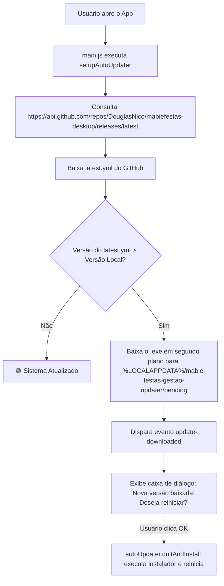

# 🌸 Memória Técnica & Histórico de Evolução — Mabiê Festas Gestão Desktop

Documento de registro arquitetural, histórico de versões, decisões técnicas e manual operacional para manutenção e geração de novas versões do sistema desktop.

---

## 📌 1. Visão Geral do Sistema

O **Mabiê Festas Gestão** é um aplicativo desktop para Windows desenvolvido para a gestão completa de acervo, montagem de orçamentos visuais, controle de devoluções/avarias, geração de contratos jurídicos e sincronização em nuvem entre múltiplos computadores.

### 🛠️ Stack Tecnológica:
* **Runtime Desktop:** Electron (Node.js + Chromium).
* **Frontend:** HTML5 Semântico, Vanilla CSS (Design System responsivo rosa/clean) e JavaScript modular (ES6).
* **Bundler:** `esbuild` (compilação ultrarrápida para `src/js/bundle.js`).
* **Banco de Dados & Sincronização:** IndexedDB / LocalStorage (armazenamento local offline-first) + Firebase Firestore (sincronização bidirecional em tempo real) + Firebase Auth.
* **Geração de Documentos:** `html2pdf.js` / Engine customizada para Contratos Jurídicos e Termos de Vistoria em PDF.
* **Instalador Windows:** NSIS 3.0 (`installer.nsi`) com permissões administrativas em `C:\Program Files\Mabiê Festas`.
* **Sistema de Auto-Update:** `electron-updater` integrado com **GitHub Releases** (`DouglasNico/mabiefestas-desktop`).
* **Hospedagem de Downloads & Site:** Vercel (`mabie-site`) com redirecionamentos automáticos via `vercel.json`.

---

## 📅 2. Histórico Detalhado de Versões e Evolução

### 🔹 v1.0.0 — Versão Base
* Estruturação inicial do sistema em abas: Montador de Orçamentos (Catálogo Visual + Carrinho), Controle de Estoque/Acervo, Gestão de Pedidos e Configurações da Empresa.
* Cálculo dinâmico de sinal (PIX), frete, regras de contrato e cálculo automático de reposições.

### 🔹 v1.0.1 — Nuvem & Multi-Usuário (Firebase)
* Implementação do `firebase-sync.js` e `auth.js`.
* Sistema de login/senha para a equipe com sincronização instantânea de pedidos, produtos e status em múltiplos notebooks.
* Indicador visual no cabeçalho: `🟢 Nuvem Conectada (Horário)`.

### 🔹 v1.0.2 — Vistoria de Acervo & Geração de PDF
* Módulo de checkout e conferência de itens alugados no retorno com registro de quebras e avarias.
* Geração do espelho do orçamento em PDF para envio aos clientes.

### 🔹 v1.0.3 — Contrato de Locação & Termo de Vistoria Jurídico Oficial
* Reescrita completa do motor de contratos em `src/js/pdf-generator.js`.
* **Cláusulas Jurídicas Integradas:**
  1. *Objeto da Locação:* Relação de artigos com tabela de **Valores de Reposição Unitária**.
  2. *Valores, Sinal e Pagamento:* Especificação de sinal prévio para reserva e quitação antes da retirada.
  3. *Prazos, Retirada, Devolução e Multa por Atraso:* Previsão de diária excedente + multa de 10% por dia de atraso.
  4. *Responsabilidade, Avarias e Reposição:* Reposição em até 48h pelo valor de tabela em caso de danos/perdas.
  5. *Conservação, Limpeza e Embalagens:* Obrigação de devolução de engradados, capas e caixas organizadoras.
  6. *Foro de Eleição:* Foro da Comarca de Campinas/SP.
* **Ficha de Vistoria Bilateral:** Campos formais para estado de conservação na Saída e no Retorno.
* **Bloco de Assinaturas:** Locador, Locatário e 2 Testemunhas com CPF.

### 🔹 v1.0.4 — Responsividade em Telas Pequenas (Escala 125% / 150%)
* Correção de sobreposição no cabeçalho em notebooks menores ou com zoom de DPI do Windows ativado (125%/150%).
* Otimização da barra de navegação superior (`.app-nav`), crachá do usuário (`.user-profile-badge`) e indicador de sincronização (`.sync-badge-wrapper`).
* Padronização de botões do sistema, eliminando estilos inline no botão de contrato.

### 🔹 v1.0.5 — Infraestrutura de Auto-Update Nativo & Remoção de Travas
* Implementação de `autoUpdater.setFeedURL({ provider: 'github', owner: 'DouglasNico', repo: 'mabiefestas-desktop' })`.
* Correção do bug do botão *"Verificar atualização agora"*: remoção da trava `app.isPackaged` e ativação de `autoUpdater.forceDevUpdateConfig = true`.
* Carregamento dinâmico da versão instalada via IPC `get-app-version`.

### 🔹 v1.0.6 — Máscara Automática de Telefone com Limite
* Formatação inteligente em tempo real em todos os campos de telefone/WhatsApp do sistema:
  * Digitação `19989632127` ➡️ Formata na hora para **`(19) 98963-2127`**.
  * Telefones fixos com 10 dígitos ➡️ Formata para **`(19) 3896-2127`**.
  * Limite rígido de 11 dígitos numéricos (`maxlength="15"` formatado).
* Aplicação em `#orc-cliente-tel`, `#cfg-telefone` e observador dinâmico (`MutationObserver`) para novos modais.

### 🔹 v1.0.7 — Empacotamento Completo de Dependências do Auto-Update
* Resolução do erro *"Modo de desenvolvimento"*: inclusão de 100% dos `node_modules` de produção (incluindo `graceful-fs`, `builder-util-runtime`, `js-yaml`, `fs-extra`) dentro do pacote de distribuição final (163 MB).
* Geração do arquivo de manifesto `latest.yml` em padrão puro ASCII / UTF-8 sem BOM com hash SHA-512 exato em Base64.

### 🔹 v1.0.8 — Janela Sempre Maximizada & Elevação de Permissões
* Ajuste no `main.js`: `mainWindow.maximize()` e `mainWindow.show()` ao iniciar, garantindo que o programa abra sempre maximizado em tela cheia.
* Configuração de `"perMachine": true` no `package.json` e `autoUpdater.quitAndInstall(false, true)` para solicitar elevação de Administrador do Windows (UAC) e reiniciar o sistema automaticamente ao aplicar o update.

---

## ⚙️ 3. Arquitetura do Auto-Update (electron-updater)

### Como funciona o fluxo:


### Regras Críticas do `latest.yml`:
1. **Sem BOM (Byte Order Mark):** O PowerShell insere BOM por padrão com `Out-File UTF8`. Deve-se sempre salvar como `[System.Text.Encoding]::ASCII` ou `New-Object System.Text.UTF8Encoding($false)`.
2. **SHA-512 em Base64:** O campo `sha512` deve conter exatamente a chave Base64 calculada sobre o binário `.exe` anexado na mesma Release.
3. **Nomes de Arquivo:** Devem coincidir perfeitamente (`Mabie.Festas.Gestao.Setup.X.X.X.exe`).

---

## 🌐 4. Integração com o Site Oficial (Vercel)

O repositório do site institucional (`mabie-site`) possui um arquivo `vercel.json` na raiz configurado com redirecionamentos HTTP 307 permanentes/dinâmicos:

* `https://www.mabiefestas.com.br/download/mabie-festas-setup.zip` ➡️ Redireciona para o download direto da release mais recente no GitHub.
* `https://www.mabiefestas.com.br/app` ➡️ Redireciona para o instalador oficial.
* `https://www.mabiefestas.com.br/download` ➡️ Redireciona para o instalador oficial.

> **Atenção:** Ao atualizar o `vercel.json`, salve sempre sem BOM para evitar o erro `Invalid vercel.json file provided` na Vercel.

---

## 🚀 5. Procedimento Operacional: Como Gerar uma Nova Versão

Quando for criar uma nova versão (ex: `v1.0.9`), siga este passo a passo:

### 1️⃣ Atualizar Números de Versão:
* `Aplicativo/package.json`: Mudar `"version": "1.0.9"`.
* `Aplicativo/installer.nsi`: Mudar `!define PRODUCT_VERSION "1.0.9"` e `OutFile "d:\Estudos\aula-sql\Aplicativo\dist\Mabie Festas Gestão Setup 1.0.9.exe"`.
* `Aplicativo/src/js/app.js`: Mudar o fallback de versão para `'v1.0.9'`.

### 2️⃣ Rodar o Script de Compilação no PowerShell:
Execute no terminal da pasta `d:\Estudos\aula-sql\Aplicativo`:
```powershell
cd "d:\Estudos\aula-sql\Aplicativo"
npx esbuild src/js/app.js --bundle --outfile=src/js/bundle.js

# Atualizar pasta de release
$outDir = "d:\Estudos\aula-sql\Mabie-Festas-App-v1.0.3\resources\app"
Copy-Item "d:\Estudos\aula-sql\Aplicativo\index.html" "$outDir\" -Force
Copy-Item "d:\Estudos\aula-sql\Aplicativo\main.js" "$outDir\" -Force
Copy-Item "d:\Estudos\aula-sql\Aplicativo\preload.js" "$outDir\" -Force
Copy-Item "d:\Estudos\aula-sql\Aplicativo\package.json" "$outDir\" -Force
Copy-Item "d:\Estudos\aula-sql\Aplicativo\src" "$outDir\" -Recurse -Force

# Sincronizar node_modules completos
robocopy "d:\Estudos\aula-sql\Aplicativo\node_modules" "$outDir\node_modules" /E /MT:8 /R:1 /W:1 /XD .bin .cache electron electron-builder

# Compilar instalador com makensis
$makensis = "C:\Users\User\AppData\Local\electron-builder\Cache\nsis-3.0.4.1\nsis-3.0.4.1-1mx3n\Bin\makensis.exe"
& $makensis "d:\Estudos\aula-sql\Aplicativo\installer.nsi"

# Calcular SHA512 e gerar latest.yml
$distDir = "d:\Estudos\aula-sql\Aplicativo\dist"
$targetExe = "$distDir\Mabie Festas Gestão Setup 1.0.9.exe"
$wrongExe = Get-ChildItem "$distDir\*1.0.9.exe" | Where-Object { $_.FullName -ne $targetExe }
if ($wrongExe) { Move-Item $wrongExe.FullName $targetExe -Force }

$hasher = [System.Security.Cryptography.SHA512]::Create()
$fileStream = [System.IO.File]::OpenRead($targetExe)
$hashBytes = $hasher.ComputeHash($fileStream)
$fileStream.Close()
$sha512Base64 = [Convert]::ToBase64String($hashBytes)
$fileSize = (Get-Item $targetExe).Length
$releaseDate = [DateTime]::UtcNow.ToString("yyyy-MM-ddTHH:mm:ss.fffZ")

$cleanYaml = @"
version: 1.0.9
files:
  - url: Mabie.Festas.Gestao.Setup.1.0.9.exe
    sha512: $sha512Base64
    size: $fileSize
path: Mabie.Festas.Gestao.Setup.1.0.9.exe
sha512: $sha512Base64
releaseDate: '$releaseDate'
"@

[System.IO.File]::WriteAllText("$distDir\latest.yml", $cleanYaml, [System.Text.Encoding]::ASCII)
Copy-Item $targetExe "$distDir\Mabie.Festas.Gestao.Setup.1.0.9.exe" -Force
Compress-Archive -Path $targetExe -DestinationPath "$distDir\mabie-festas-setup.zip" -Force

# Atualizar redirect do site
$siteDir = "C:\Users\User\OneDrive - HITSS DO BRASIL SERVIÇOS TECNOLOGICOS LTDA\sites\mabiefestas\mabie-site"
$vercelConfig = @"
{
  "`$schema": "https://openapi.vercel.sh/vercel.json",
  "redirects": [
    {
      "source": "/download/mabie-festas-setup.zip",
      "destination": "https://github.com/DouglasNico/mabiefestas-desktop/releases/download/v1.0.9/mabie-festas-setup.zip",
      "permanent": false
    },
    {
      "source": "/app",
      "destination": "https://github.com/DouglasNico/mabiefestas-desktop/releases/download/v1.0.9/mabie-festas-setup.zip",
      "permanent": false
    },
    {
      "source": "/download",
      "destination": "https://github.com/DouglasNico/mabiefestas-desktop/releases/download/v1.0.9/mabie-festas-setup.zip",
      "permanent": false
    }
  ]
}
"@
[System.IO.File]::WriteAllText("$siteDir\vercel.json", $vercelConfig, (New-Object System.Text.UTF8Encoding($false)))
cd $siteDir; git add vercel.json; git commit -m "feat(download): redirect release v1.0.9"; git push origin main

# Commit e push do desktop
cd "d:\Estudos\aula-sql\Aplicativo"; git add .; git commit -m "feat(v1.0.9): release 1.0.9"; git push origin main
```

### 3️⃣ Publicar no GitHub Releases:
1. Acesse: `https://github.com/DouglasNico/mabiefestas-desktop/releases/new`
2. Crie a tag `v1.0.9`.
3. Anexe os 3 arquivos da pasta `Aplicativo/dist/`:
   * `latest.yml`
   * `Mabie.Festas.Gestao.Setup.1.0.9.exe`
   * `mabie-festas-setup.zip`
4. Clique em **Publish release**.

---

## 📂 6. Mapa dos Arquivos Chave

| Arquivo | Função Principal |
| :--- | :--- |
| `Aplicativo/main.js` | Processo Principal do Electron, criação de janela maximizada, IPC Handlers e Auto-Updater. |
| `Aplicativo/preload.js` | Ponte de segurança e comunicação IPC (`electronAPI`) entre Node.js e o Navegador. |
| `Aplicativo/installer.nsi` | Script compilador do instalador NSIS para `$PROGRAMFILES64\Mabiê Festas`. |
| `Aplicativo/index.html` | Estrutura HTML das 4 abas (Orçamento, Estoque, Pedidos, Configurações). |
| `Aplicativo/src/css/style.css` | Folha de estilos oficial, Design System, paleta de cores rosa e regras de responsividade. |
| `Aplicativo/src/js/app.js` | Orquestrador principal da aplicação, navegação, máscaras de telefone e eventos de update. |
| `Aplicativo/src/js/pdf-generator.js` | Motor de geração de Contrato Formal de Locação, Termo de Vistoria e Orçamento em PDF. |
| `Aplicativo/src/js/firebase-sync.js` | Módulo de sincronização bidirecional em tempo real com Firestore. |
| `Aplicativo/src/js/auth.js` | Módulo de autenticação de usuários da equipe com Firebase Auth. |
| `Aplicativo/src/js/orcamento.js` | Catálogo de produtos, filtros de categoria, carrinho e montador de orçamentos. |
| `Aplicativo/src/js/estoque.js` | Cadastro, edição, controle de quantidades disponíveis e fotos de artigos. |
| `Aplicativo/src/js/pedidos.js` | Gestão de status de locações, devoluções, checklist de vistoria e avarias. |
| `Aplicativo/src/js/storage.js` | Camada de persistência local offline (LocalStorage / IndexedDB). |

---

*Arquivo registrado e mantido atualizado na raiz de `Aplicativo/memoria.md` para referência futura da equipe técnica.* 🌸
